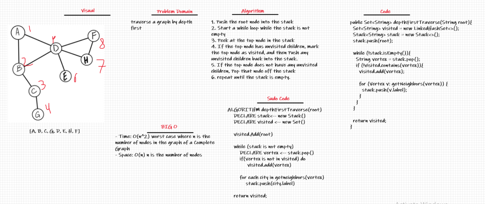

# Challenge Summary
Conduct a depth first preorder traversal on a graph

## Whiteboard Process

## Approach & Efficiency
- Time: O(n^2) worst case where n is the number of nodes in the graph of a Complete Graph
- Space: O(n) n is the number of nodes

## Solution
1. Push the root node into the stack
2. Start a while loop while the stack is not empty
3. Peek at the top node in the stack
4. If the top node has unvisited children, mark the top node as visited, and then Push any unvisited children back into the stack.
5. If the top node does not have any unvisited children, Pop that node off the stack
6. repeat until the stack is empty.