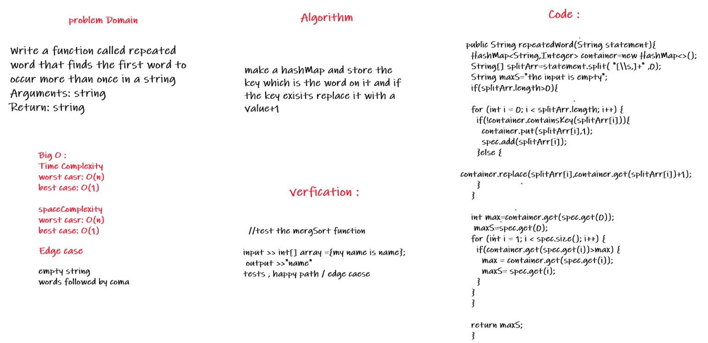

# Challenge Summary
Given a String as input it is required to return the first repeated word in that string

## Whiteboard Process

## Approach & Efficiency
1. Time:
   1. Worst case: O(n) where n is the number of words in the string
   2. Best case: O(1)
2. Space:
   1. Worst case: O(n) where n is the number of words in the string
   2. Best case: O(1)

## Solution
Using a hashMap I stored every word as a key and if the word exist I will add 1 to its value and if it does not exist I will initialize the value to 1 then when the first value become 2 I will return that word