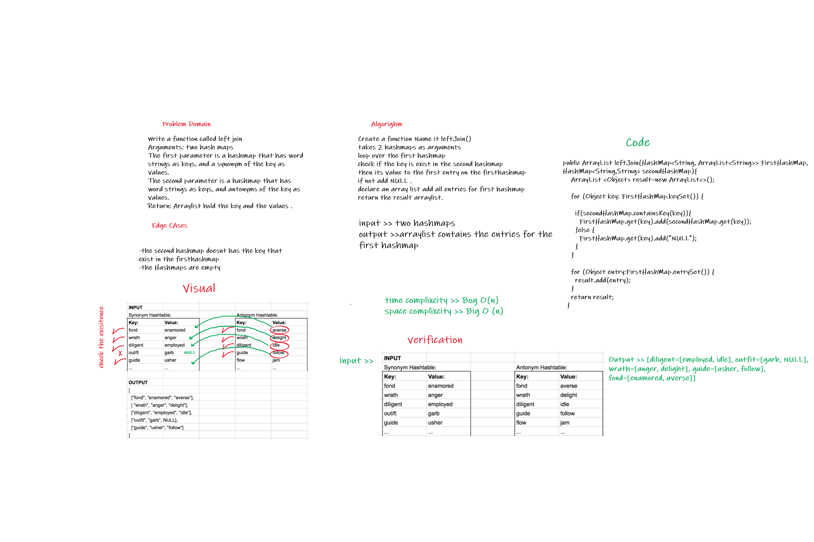

# Hashmap LEFT JOIN
<!-- Short summary or background information -->
The LEFT JOIN command returns all rows from the left table, and the matching rows from the right table. The result is NULL from the right side, if there is no match.

## Challenge
<!-- Description of the challenge -->
Handle adding more than one value to the key in the left hashmap.

## Approach & Efficiency
<!-- What approach did you take? Why? What is the Big O space/time for this approach? -->
Time Big O(n)
space Big O(n)

## Solution
<!-- Embedded whiteboard image -->
```
public ArrayList leftJoin(HashMap<String, ArrayList<String>> FirstHashMap, HashMap<String,String> secondHashMap){
    ArrayList <Object> result=new ArrayList<>();
    for (Object key: FirstHashMap.keySet()) {
      if(secondHashMap.containsKey(key)){
        FirstHashMap.get(key).add(secondHashMap.get(key));
      }else {
        FirstHashMap.get(key).add("NULL");
      }
    }

    for (Object entry:FirstHashMap.entrySet()) {
      result.add(entry);
    }
    return result;
  }

  ```

  ## WhiteBoared


