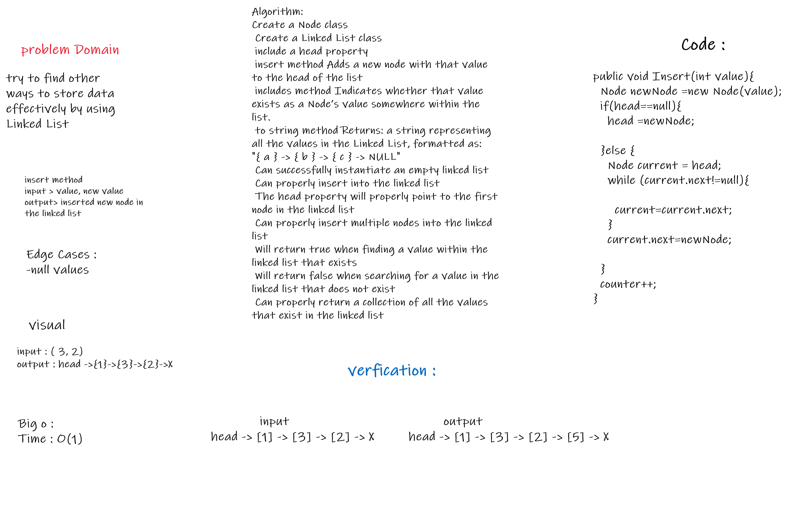
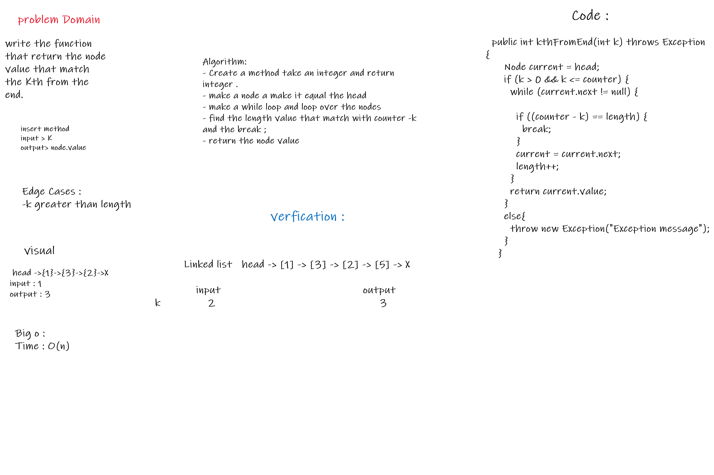
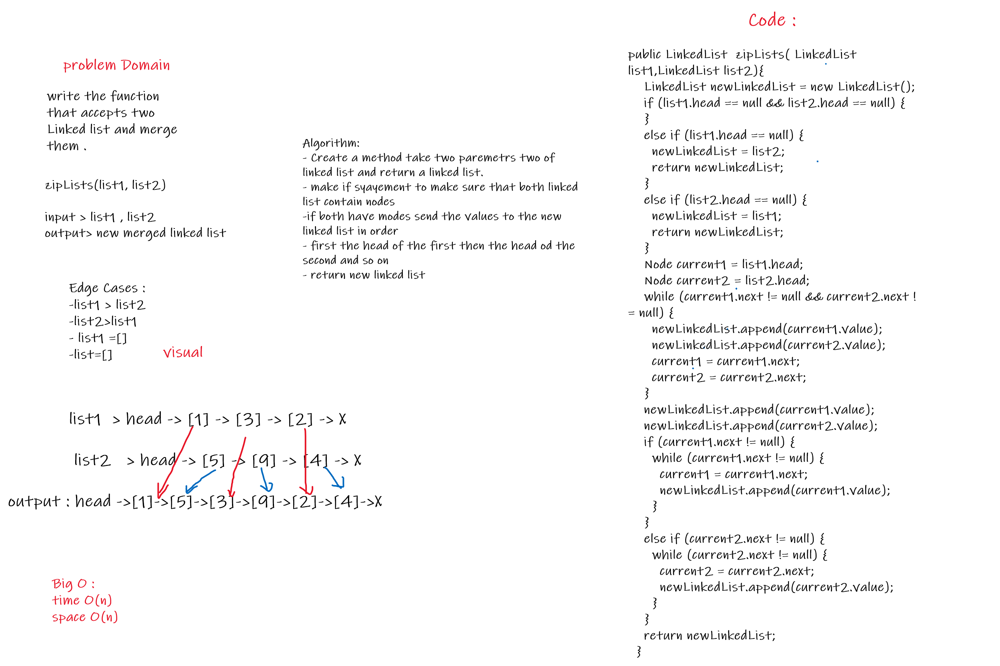

## Singly Linked List
A linked list is a common data structure that is made of a chain of nodes. Each node contains a value and a pointer to the next node in the chain.

### Challenge
one of the challenges was how to know if the inserted node is inserted successfully by know the length of the linked list .  
I made a counter as a property in linked list class and each time we go throuth the Insert functuion and insert to make it plus one , eventually its going to be the linked list length. 

### Approach & Efficiency
<!-- What approach did you take? Why? What is the Big O space/time for this approach? -->
Used Classes to implement the linked list with the O(1) and O(n) for it's methods .

### API

**insert** 
Arguments: value 
Returns: nothing 
This method Adds a new node with that value to the head of the list with an O(1) Time performance. 
And if the head doesnt equal null it will add that value to the next node. 

**includes** 
Arguments: value 
Returns: Boolean 
Indicates whether that value exists as a Node’s value somewhere within the list. 
This method will return true if the value found in the linked list and false if not . 

**to string**
Arguments: none  
Returns: a string representing all the values in the Linked List, formatted as: 
"{ a } -> { b } -> { c } -> NULL" 

**append**
 arguments: new value 
adds a new node with the given value to the end of the list 

**insertBefore**: 
 insert a new node before a given value 

**insertAfter**: 
 insert a new node after a given value 

 

 

 

**kth from end** 
argument: a number, k, as a parameter. 
Return the node’s value that is k places from the tail of the linked list. 
It has access to the Node class and all the properties on the Linked List class  

 

 

**zipLists** 
write the function that accepts two Linked list and merge them . 

**in the test file I have tests for:**  
add a node to the end of the linked list 
 add multiple nodes to the end of a linked list 
 insert a node before a node located i the middle of a linked list 
 insert a node before the first node of a linked list 
 insert after a node in the middle of the linked list 
 insert a node after the last node of the linked list 
