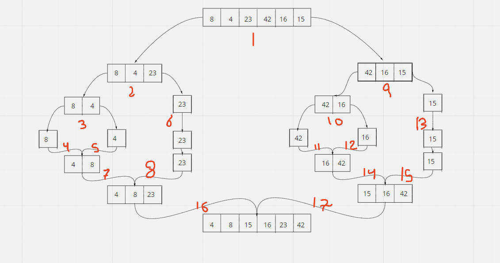

# Merge Sort
Merge sort is a “divide and conquer” algorithm wherein we first divide the array into smaller arrays. When the smaller arrays are of length 1, we compare and combine them together to get the final sorted solution to the array.

## Pseudocode
```
ALGORITHM Mergesort(arr)
    DECLARE n <-- arr.length

    if n > 1
      DECLARE mid <-- n/2
      DECLARE left <-- arr[0...mid]
      DECLARE right <-- arr[mid...n]
      // sort the left side
      Mergesort(left)
      // sort the right side
      Mergesort(right)
      // merge the sorted left and right sides together
      Merge(left, right, arr)

ALGORITHM Merge(left, right, arr)
    DECLARE i <-- 0
    DECLARE j <-- 0
    DECLARE k <-- 0

    while i < left.length && j < right.length
        if left[i] <= right[j]
            arr[k] <-- left[i]
            i <-- i + 1
        else
            arr[k] <-- right[j]
            j <-- j + 1

        k <-- k + 1

    if i = left.length
       set remaining entries in arr to remaining values in right
    else
       set remaining entries in arr to remaining values in left
```

## Working Code
```

    public static int[] mergeSort(int[] arr){

      int n=arr.length;

      if(n>1){
        int mid = n/2;
       int[] left = Arrays.copyOfRange(arr,0,mid);
        int[] right=Arrays.copyOfRange(arr,mid,n);

        mergeSort(left);
        mergeSort(right);
       merge(left,right,arr);

        }
      return arr;
      }

      public static int[] merge(int[] left,int[] right ,int[] arr){
        int i=0;
        int j=0;
        int k=0;

        while (i<left.length && j<right.length){
          if(left[i]<= right[j]){
            arr[k]=left[i];
            i++;
          }else{
            arr[k]=right[j];
            j++;
          }
          k++;
        }

        if(i==left.length){
          for (int l = j; l < right.length; l++) {
            arr[k] = right[l];
            k++;
          }
        }

        if(j==right.length){
          for (int r = i; r < left.length; r++) {
            arr[k] = left[r];
            k++;
          }
        }

    return arr;
    }
```
## Trace
Sample Array: [8,4,23,42,16,15]




## Efficiency
1. Time: Time complexity of Merge Sort is  `O(nLogn)` in all 3 cases (worst, average and best) as merge sort always divides the array into two halves and takes linear time to merge two halves.
2. Space: `O(n)`