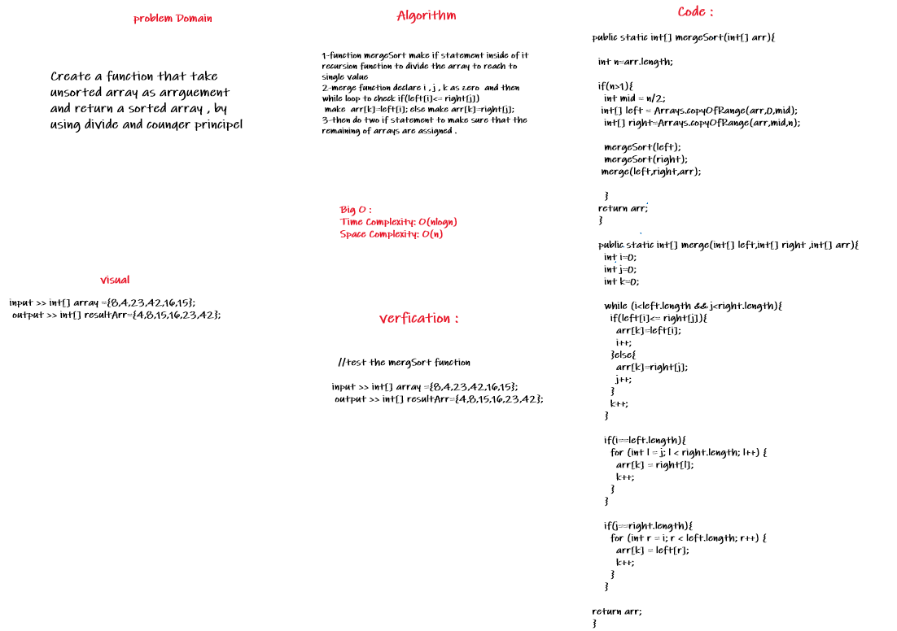

# Challenge Summary
<!-- Description of the challenge -->
understanding and trace the impementation was a bit tricky, so its working in divid the array and merge it but while it is merging it do the sorting in each step of merging.

## Whiteboard Process
<!-- Embedded whiteboard image -->

## Approach & Efficiency
<!-- What approach did you take? Why? What is the Big O space/time for this approach? -->
1. Time: Time complexity of Merge Sort is  `O(nLogn)` in all 3 cases (worst, average and best) as merge sort always divides the array into two halves and takes linear time to merge two halves.
2. Space: `O(n)`

