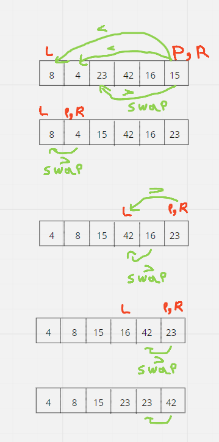

# Quick Sort
Like Merge Sort, QuickSort is a Divide and Conquer algorithm. It picks an element as pivot and partitions the given array around the picked pivot.
The key process in quickSort is partition(). Target of partitions is, given an array and an element x of array as pivot, put x at its correct position in sorted array and put all smaller elements (smaller than x) before x, and put all greater elements (greater than x) after x.

## Pseudocode
```
ALGORITHM QuickSort(arr, left, right)
    if left < right
        // Partition the array by setting the position of the pivot value
        DEFINE position <-- Partition(arr, left, right)
        // Sort the left
        QuickSort(arr, left, position - 1)
        // Sort the right
        QuickSort(arr, position + 1, right)

ALGORITHM Partition(arr, left, right)
    // set a pivot value as a point of reference
    DEFINE pivot <-- arr[right]
    // create a variable to track the largest index of numbers lower than the defined pivot
    DEFINE low <-- left - 1
    for i <- left to right do
        if arr[i] <= pivot
            low++
            Swap(arr, i, low)

     // place the value of the pivot location in the middle.
     // all numbers smaller than the pivot are on the left, larger on the right.
     Swap(arr, right, low + 1)
    // return the pivot index point
     return low + 1

ALGORITHM Swap(arr, i, low)
    DEFINE temp;
    temp <-- arr[i]
    arr[i] <-- arr[low]
    arr[low] <-- temp
```

## Working Code
[MergeSort](MergeSort.java)
```java
public class QuickSort {

  public void quickSort(int[] arr, int left, int right) {
    if (left < right) {
      // Partition the array by setting the position of the pivot value
      int position = partition(arr, left, right);
      // Sort the left
      quickSort(arr, left, position - 1);
      // Sort the right
      quickSort(arr, position + 1, right);
    }
  }

  private int partition(int[] arr, int left, int right) {
    // set a pivot value as a point of reference
    int pivot = arr[right];
    // create a variable to track the largest index of numbers lower than the defined pivot
    int low = left - 1;

    for (int i = left; i < right; i++) {
      if (arr[i] <= pivot) {
        low++;
        swap(arr, i, low);
      }
    }
    // place the value of the pivot location in the middle.
    // all numbers smaller than the pivot are on the left, larger on the right.
    swap(arr, right, low + 1);
    // return the pivot index point
    return low + 1;
  }

  private void swap(int[] arr, int i, int low) {
    int temp = arr[i];
    arr[i] = arr[low];
    arr[low] = temp;
  }
}
```
## Trace
Sample Array: [8,4,23,42,16,15]



## Efficiency
1. Time: Quicksort uses the partitioning method and can perform, at best and on average, at `O(n log (n))`. It can, however, perform at `O(n2)` in the worst case
2. Space: The worst case space used will be `O(n)` . The average case space used will be of the order `O(log n)` .