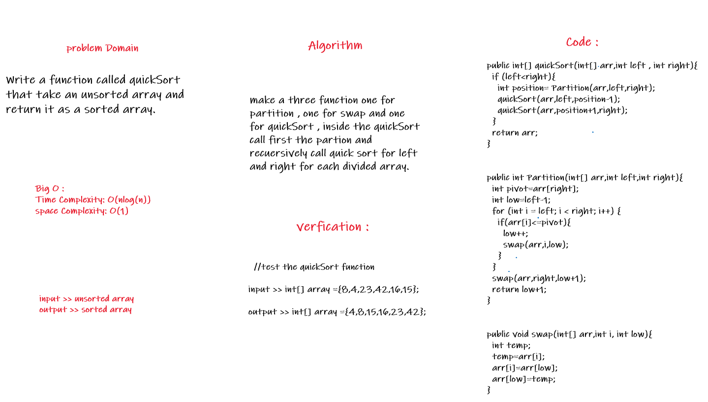

## Challenge Summary
Write the Implementation for the quick Sort algorithm and test your implementation so you will be able to give your method an unordered array and return an ordered array
## White Board

## Code
- quickSort, partition and swap methods.

## Trace
- pass the array to the quickSort function with the left and right (the idx of the first and the last elements)
- call the partition method so it will assume the pivot= 15 is the largest number
- compare the pivot with the elements of the array starting from left
- when we find element larger than 15 we will save it's idx (low)
- swap the pivot with the larger value and return the new position of the pivot
- recursive call for the quickSort and pass to it the segment before the new posistion
- recursive call for the quickSort and pass to it the segment after the new posistion
- after we finish the sort for the both segments we will get the orderd array

## Approach & Efficiency
- Space O(log(n))
- Time O(nlog(n))