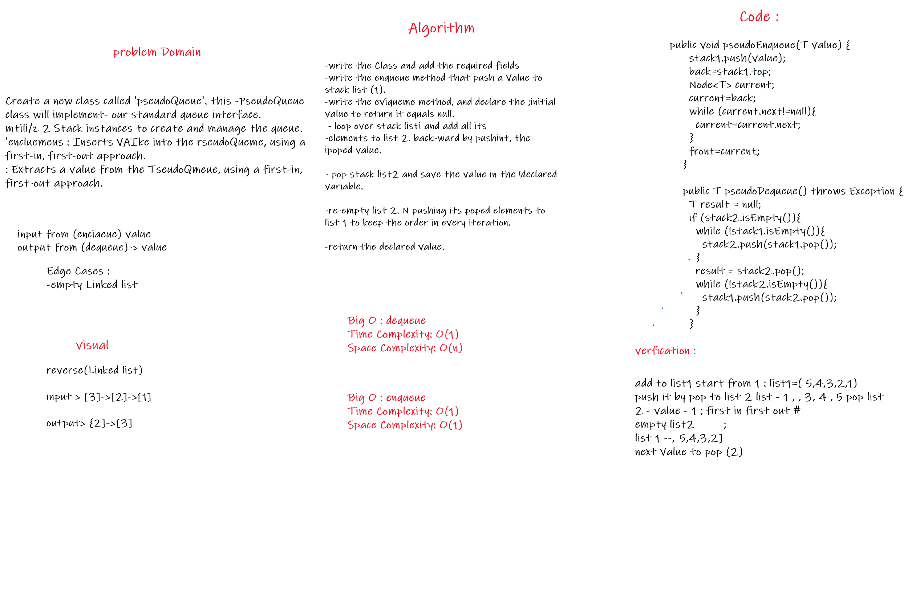
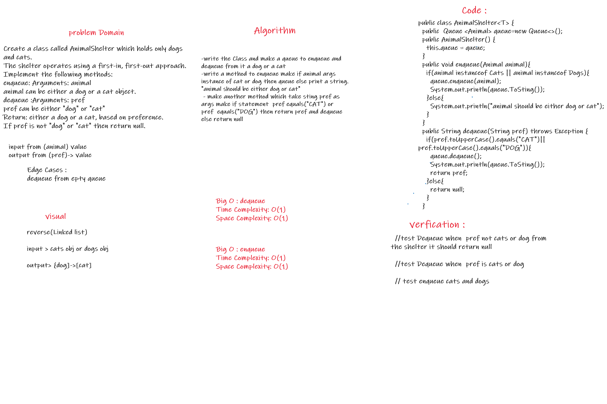

# Stack and Queue 
## Stack 
A stack is a data structure that consists of Nodes. Each Node references the next Node in the stack, but does  not reference its previous. 

# Challenge
Create a Stack, and a Queue that have the top properties. 

# Approach & Efficiency 

All the methods in the Stack and Queue classes are of a big O(1) time complexity 

# API

Common terminology for a stack is: 

1- Push - Nodes or items that are put into the stack are pushed. 

2- Pop - Nodes or items that are removed from the stack are popped. When you attempt to pop an empty stack an  exception will be raised. 

3- Peek - When you peek you will view the value of the top Node in the stack. When you attempt to peek an empty  stack an exception will be raised. 

4- IsEmpty - returns true when stack is empty otherwise returns false. 

## Queue 
Common terminology for a queue is: 
1- Enqueue - Nodes or items that are added to the queue. 

2- Dequeue - Nodes or items that are removed from the queue. If called when the queue is empty an exception  will be raised. 

4- Peek - When you peek you will view the value of the front Node in the queue. If called when the queue is  empty an exception will be raised. 

5- IsEmpty - returns true when queue is empty otherwise returns false. 

## Challenge Pseudo Queue 

Create a new class called pseudo queue. this PseudoQueue class will implement our standard queue interface.  Internally, utilize 2 Stack instances to create and manage the queue. 

pseudoEnqueue() : Inserts value into the PseudoQueue, using a first-in, first-out approach. 

pseudoDequeue() : Extracts a value from the PseudoQueue, using a first-in, first-out approach. 

## White borad  

Approach & Efficiency 

pseudoEnqueue() : Inserts value into the PseudoQueue, using a first-in, first-out approach. 

Space: O(1) 

Time : O(1) 

pseudoDequeue() : Extracts a value from the PseudoQueue, using a first-in, first-out approach. 

Space: O(1) 

Time : O(n) 

## Challenge Animal Shelter  

Create a class called AnimalShelter which holds only dogs and cats, using a first-in, first-out approach. 

enqueue() : animal can be either a dog or a cat object., using a first-in, first-out approach. 

dequeue() : Extracts a either a dog or a cat, based on preference, using a first-in, first-out approach. If  pref is not "dog" or "cat" then return null. 

Whiteboard Process 

Approach & Efficiency  

enqueue() :  

Space: O(1)  

Time : O(1)  

dequeue() : 

Space: O(1)  

Time : O(1)  

