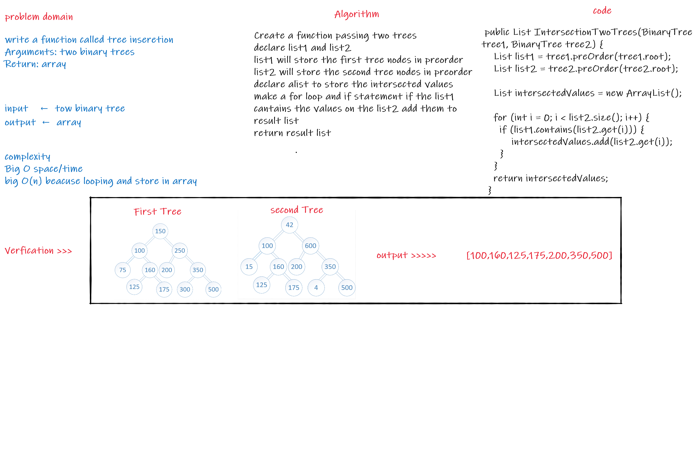

 # Challenge Summary

Write a function called tree intersection
Arguments: two binary trees
Return: array

## White Board


## Code
```
 public List IntersectionTwoTrees(BinaryTree tree1, BinaryTree tree2) {
    List list1 = tree1.preOrder(tree1.root);
    List list2 = tree2.preOrder(tree2.root);

    List intersectedValues = new ArrayList();

    for (int i = 0; i < list2.size(); i++) {
      if (list1.contains(list2.get(i))) {
          intersectedValues.add(list2.get(i));
      }
    }
    return intersectedValues;
  }
  
```


## Approach & Efficiency
complexity
Big O space/time
big O(n) beacuse looping and store in array